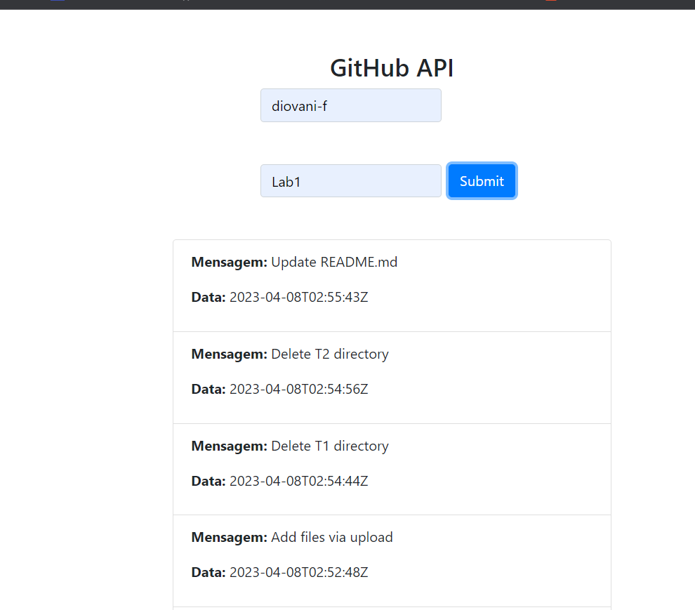

# Projeto2a: GitHub API e DOM Manipulation

.

Acesso: https://elc1090.github.io/project2a-diovani-guilherme/

#### Desenvolvedor(a)
Diovani Facco

#### Tecnologias

- GitHub API
- HTML
- JavaScript

#### Ambiente de desenvolvimento

- VS Code
- Chrome

#### Créditos

Preencha aqui uma lista detalhada de recursos aproveitados no projeto, por exemplo:
- https://docs.github.com/pt/rest?apiVersion=2022-11-28
- https://codesnippet.io/github-api-tutorial/

#### Bastidores

De início foi bem complicado entender o que a API estava fazendo, e como ela passava as informações para o site. Porém revisando algumas vezes o código e os 
tutoriais, o código começou a sair. Peguei o código disponibilizado e fui fazendo alterações conforme as especificações.
---
Projeto entregue para a disciplina de [Desenvolvimento de Software para a Web](http://github.com/andreainfufsm/elc1090-2023a) em 2023a
